Clustering and PCA on Wholesale Customers Data
==================

This project analyses the Dataset provided at [this link](https://archive.ics.uci.edu/ml/datasets/Wholesale+customers) that refers to customers of a wholelase distributor in Portugal. 

In this report, we explore different clustering methods, optimize their parameters looking for the best possible performance and finally come up with insights of how the customers may be grouped according to their consumption behavior. 

Principal Component Analysis is also applied to the data and the first two principal components are visualized and inspected on how they correlate to the dataset features and obtained clusters.

Features Description
====================

**FRESH:** annual spending (m.u.) on fresh products;  
**MILK:** annual spending (m.u.) on milk products;  
**GROCERY:** annual spending (m.u.) on grocery products;  
**FROZEN:** annual spending (m.u.) on frozen products;  
**DETERGENTS_PAPER:** annual spending (m.u.) on detergents and paper products;  
**DELICATESSEN:** annual spending (m.u.) on delicatessen products;  
**CHANNEL:** customers channel - Horeca (Hotel/Restaurant/Café) or Retail channel;  
**REGION:** customers Region - Lisbon, Porto or Other.

m.u. refers to the spending in monetary units.

Libraries
=========

``` r
library(ggfortify) # due to autplot
library(purrr) # due to map_dbl
library(cluster) # due to silhouette
```

Loading the Data
================

``` r
raw_data <- read.csv("wholesale_customers_data.csv")
```

``` r
dim(raw_data)
```

    ## [1] 440   8

The dataset contains 440 observations and 8 features. Bellow, we have
the features.

``` r
str(raw_data)
```

    ## 'data.frame':    440 obs. of  8 variables:
    ##  $ Channel         : int  2 2 2 1 2 2 2 2 1 2 ...
    ##  $ Region          : int  3 3 3 3 3 3 3 3 3 3 ...
    ##  $ Fresh           : int  12669 7057 6353 13265 22615 9413 12126 7579 5963 6006 ...
    ##  $ Milk            : int  9656 9810 8808 1196 5410 8259 3199 4956 3648 11093 ...
    ##  $ Grocery         : int  7561 9568 7684 4221 7198 5126 6975 9426 6192 18881 ...
    ##  $ Frozen          : int  214 1762 2405 6404 3915 666 480 1669 425 1159 ...
    ##  $ Detergents_Paper: int  2674 3293 3516 507 1777 1795 3140 3321 1716 7425 ...
    ##  $ Delicassen      : int  1338 1776 7844 1788 5185 1451 545 2566 750 2098 ...

Hierarchical Clustering
=======================

``` r
hc.complete = hclust(dist(raw_data[, -c(1, 2)]), method="ward.D")
```

Plotting the Dendrograms
------------------------

``` r
plot(hc.complete, xlab="", sub="", cex=.9)
```

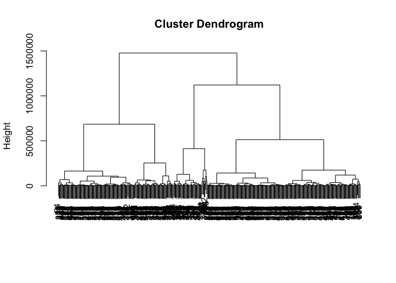

Cutting in Four Clusters
------------------------

``` r
hc.tree = cutree(hc.complete, 4)
table(hc.tree)
```

    ## hc.tree
    ##   1   2   3   4 
    ## 111 223  57  49

There are 111 observations in cluster 1, 223 observations in cluster 2,
57 observations in cluster 3 and 49 observations in cluster 4.

Clustering with Scaled Data
---------------------------

``` r
scaled_data = raw_data
scaled_data[, -c(1, 2)] = scale(raw_data[, -c(1, 2)])
hc.scaled = hclust(dist(scaled_data[, -c(1, 2)]), method="ward.D")
```

### Dendrogram

``` r
plot(hc.scaled, xlab="", sub="", cex=.9)
```

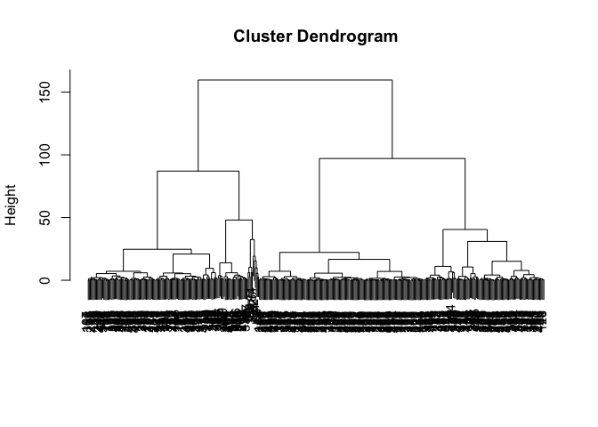

Scaling the data changes the structure of the tree. The height of it has
decreased. Also, when using 4 clusters, the number of observations on
cluster 2 and 4 has decreased.

### Cutting in Four Clusters

``` r
hc.tree_sc = cutree(hc.scaled, 4)
table(hc.tree_sc)
```

    ## hc.tree_sc
    ##   1   2   3   4 
    ## 125 159 116  40

Now cluster 1 contains 125 observations, cluster 2, 159 observations,
cluster 3, 116 observations, and cluster 4, observations.

**Q:** *In your opinion, should be the variables be scaled before the
inter-observation dissimilarities are computed? Provide a justification
for your answer.*

Before answering this question, let’s analyse the summary table in order
to check for possible discrepances on the features.

``` r
summary(raw_data[, -c(1, 2)])
```

    ##      Fresh             Milk          Grocery          Frozen       
    ##  Min.   :     3   Min.   :   55   Min.   :    3   Min.   :   25.0  
    ##  1st Qu.:  3128   1st Qu.: 1533   1st Qu.: 2153   1st Qu.:  742.2  
    ##  Median :  8504   Median : 3627   Median : 4756   Median : 1526.0  
    ##  Mean   : 12000   Mean   : 5796   Mean   : 7951   Mean   : 3071.9  
    ##  3rd Qu.: 16934   3rd Qu.: 7190   3rd Qu.:10656   3rd Qu.: 3554.2  
    ##  Max.   :112151   Max.   :73498   Max.   :92780   Max.   :60869.0  
    ##  Detergents_Paper    Delicassen     
    ##  Min.   :    3.0   Min.   :    3.0  
    ##  1st Qu.:  256.8   1st Qu.:  408.2  
    ##  Median :  816.5   Median :  965.5  
    ##  Mean   : 2881.5   Mean   : 1524.9  
    ##  3rd Qu.: 3922.0   3rd Qu.: 1820.2  
    ##  Max.   :40827.0   Max.   :47943.0

``` r
sapply(raw_data[, -c(1, 2)], sd, na.rm=TRUE)
```

    ##            Fresh             Milk          Grocery           Frozen 
    ##        12647.329         7380.377         9503.163         4854.673 
    ## Detergents_Paper       Delicassen 
    ##         4767.854         2820.106

As the previous descriptive statistics have shown, the features
*Frozen*, *Detergents\_Paper*, and *Delicassen* have lower median and
standard deviation when compared to the remaining features. This means
that the former three features will effect less the clustering process
than the features *Fresh*, *Milk*, and *Grocery*.

In our opinion, scaling the features depends on the purpose of the
clustering. For instance, if the clusters will serve as inputs for a
customer segmented marketing campaign, then scaling is a good practice
given that all the features will have the same weight during the
clustering processing. As a result, people that buy more delicassen
products than the average consumer may be clustered on the same group,
allowing the stores to offer better delicassen discounts to this group
of consumers. This is only possible because, after scaling, all features
will have equal importance in the clustering.

On the other hand, in cases where the volumetry of products bought in
absolute values is more important and should have more weight during the
clustering process, scaling may be unnecessary.

Principal Component Analysis
============================

PCA on Raw Data
---------------

``` r
pr.out = prcomp(raw_data[, -c(1,2)])
```

### Loadings

``` r
pr.out$rotation
```

    ##                           PC1         PC2        PC3         PC4
    ## Fresh            -0.976536846 -0.11061386 -0.1785573 -0.04187648
    ## Milk             -0.121184071  0.51580216  0.5098868 -0.64564047
    ## Grocery          -0.061540393  0.76460638 -0.2757809  0.37546049
    ## Frozen           -0.152364619 -0.01872345  0.7142004  0.64629232
    ## Detergents_Paper  0.007054173  0.36535076 -0.2044099  0.14938013
    ## Delicassen       -0.068104710  0.05707921  0.2832175 -0.02039579
    ##                         PC5         PC6
    ## Fresh             0.0159860 -0.01576316
    ## Milk              0.2032357  0.03349187
    ## Grocery          -0.1602915  0.41093894
    ## Frozen            0.2201861 -0.01328898
    ## Detergents_Paper  0.2079302 -0.87128428
    ## Delicassen       -0.9170766 -0.26541687

### Create a new Feature for the Clusters

``` r
unscaled_data <- raw_data
unscaled_data$Cluster <- as.factor(hc.tree)
```

### Plotting the First Two Principal Components

``` r
autoplot(prcomp(unscaled_data[, -c(1,2, 9)]), data=unscaled_data, title="Biplot with Scaled Data",
         colour="Cluster", loadings=TRUE, loadings.label=TRUE, loadings.label.size=3.5)
```

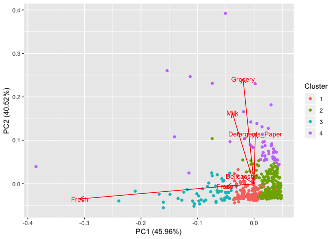

Consistently to what showed the loadings matrix, the first principal
component is almost only influenced by the feature *Fresh*, while the
second principal component is influenced by the features *Grocery*,
*Milk* and *Detergents\_Paper*. It is also possible to notice that the
feature *Fresh* is strongly influencing on how the clusters are
arranged. The observations on the first, second and thrid cluster
basically only differ on the magnitude of their respective projections
on the first principal component.

PCA on Scaled Data
------------------

``` r
pr.scaled = prcomp(scaled_data[, -c(1,2)])
```

### Loadings

``` r
pr.scaled$rotation
```

    ##                          PC1         PC2         PC3         PC4
    ## Fresh            -0.04288396 -0.52793212 -0.81225657 -0.23668559
    ## Milk             -0.54511832 -0.08316765  0.06038798 -0.08718991
    ## Grocery          -0.57925635  0.14608818 -0.10838401  0.10598745
    ## Frozen           -0.05118859 -0.61127764  0.17838615  0.76868266
    ## Detergents_Paper -0.54864020  0.25523316 -0.13619225  0.17174406
    ## Delicassen       -0.24868198 -0.50420705  0.52390412 -0.55206472
    ##                          PC5         PC6
    ## Fresh             0.04868278  0.03602539
    ## Milk             -0.82657929  0.03804019
    ## Grocery           0.31499943 -0.72174458
    ## Frozen            0.02793224  0.01563715
    ## Detergents_Paper  0.33964012  0.68589373
    ## Delicassen        0.31470051  0.07513412

### Create a new Feature for the Clusters

``` r
scaled_data$Cluster <- as.factor(hc.tree_sc)
```

### Plotting the First Two Principal Compontents

``` r
autoplot(prcomp(scaled_data[, -c(1,2, 9)]), data=scaled_data, 
         colour="Cluster", loadings=TRUE, loadings.label=TRUE, loadings.label.size=3.5)
```

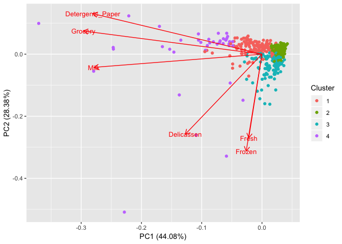

As expected, scaling the data before PCA makes the loadings more
balanced. This way, each feature receives equal weight when computing
PCA, meaning that none of them will overcome the others, as it has
ocurred with the *Fresh* variable with not scaled data. Now, it is not
easy to visualize a clear different characteristic between the clusters.
It seems that now there is more overlapping between the clusters.

k-means
=======

k-means on Raw Data
-------------------

### Average Silhouette Width

``` r
# extracted from https://uc-r.github.io/kmeans_clustering

# function to compute average silhouette for k clusters
avg_sil <- function(k) {
  km.out <- kmeans(raw_data[, -c(1, 2)], centers=k, nstart=25)
  ss <- silhouette(km.out$cluster, dist(raw_data))
  mean(ss[, 3])
}

# compute and plot average silhouette width for k between 2 and 15
k.values <- 2:15

# extract avg silhouette for 2-15 clusters
avg_sil_values_kmeans_raw <- map_dbl(k.values, avg_sil)

plot(k.values, avg_sil_values_kmeans_raw,
      type = "b", pch=19, frame = FALSE,
      xlab = "Number of Clusters K",
      ylab = "Average Silhouette Width",
      main = "Looking for Optimal K in k-means with Raw Data")
```

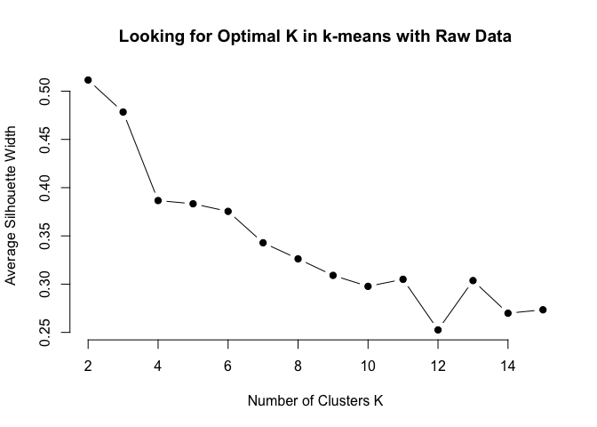

### Comparison with Hierarchical Clustering

``` r
# extracted from https://uc-r.github.io/kmeans_clustering

# function to compute average silhouette for k clusters
avg_sil <- function(k) {
  ss <- silhouette(cutree(hc.complete, k), dist(raw_data[, -c(1, 2)]))
  mean(ss[, 3])
}

# compute and plot average silhouette width for k between 2 and 15
k.values <- 2:15

# extract avg silhouette for 2-15 clusters
avg_sil_values_hclust_raw <- map_dbl(k.values, avg_sil)

plot(k.values, avg_sil_values_hclust_raw,
      type = "b", pch=19, frame = FALSE,
      xlab = "Number of Clusters K",
      ylab = "Average Silhouette Width",
      main = "Looking for Optimal K in hclust with Raw Data")
```

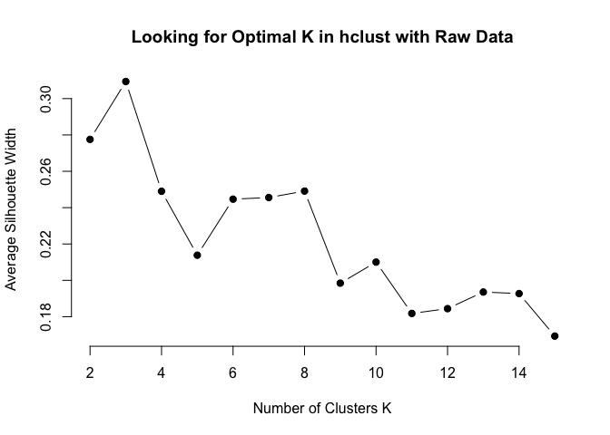

k-means on Scaled Data
----------------------

### Average Silhouette Width

``` r
# extracted from https://uc-r.github.io/kmeans_clustering

# function to compute average silhouette for k clusters
avg_sil <- function(k) {
  km.out <- kmeans(scaled_data[, -c(1, 2, 9)], centers=k, nstart=25)
  ss <- silhouette(km.out$cluster, dist(scaled_data[, -c(1, 2, 9)]))
  mean(ss[, 3])
}

# compute and plot average silhouette width for k between 2 and 15
k.values <- 2:15

# extract avg silhouette for 2-15 clusters
avg_sil_values_kmeans_scaled <- map_dbl(k.values, avg_sil)

plot(k.values, avg_sil_values_kmeans_scaled,
      type = "b", pch=19, frame = FALSE,
      xlab = "Number of Clusters K",
      ylab = "Average Silhouette Width",
      main = "Looking for Optimal K in k-means with Scaled Data")
```

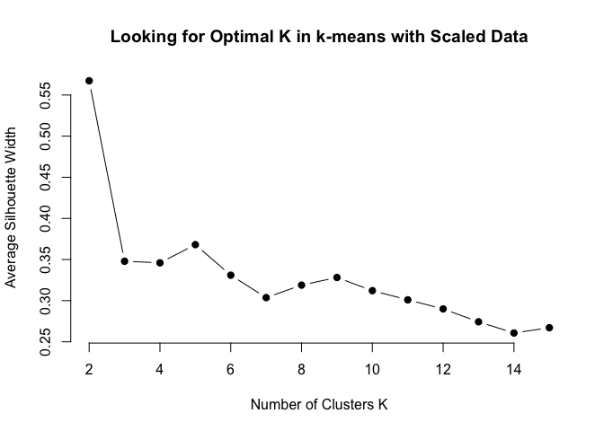

### Comparison with Hierarchical Clustering

``` r
# extracted from https://uc-r.github.io/kmeans_clustering

# function to compute average silhouette for k clusters
avg_sil <- function(k) {
  ss <- silhouette(cutree(hc.scaled, k), dist(scaled_data[, -c(1, 2, 9)]))
  mean(ss[, 3])
}

# compute and plot average silhouette width for k between 2 and 15
k.values <- 2:15

# extract avg silhouette for 2-15 clusters
avg_sil_values_hclust_scaled <- map_dbl(k.values, avg_sil)

plot(k.values, avg_sil_values_hclust_scaled,
      type = "b", pch=19, frame = FALSE,
      xlab = "Number of Clusters K",
      ylab = "Average Silhouette Width",
      main = "Looking for Optimal K in hclust with Scaled Data")
```

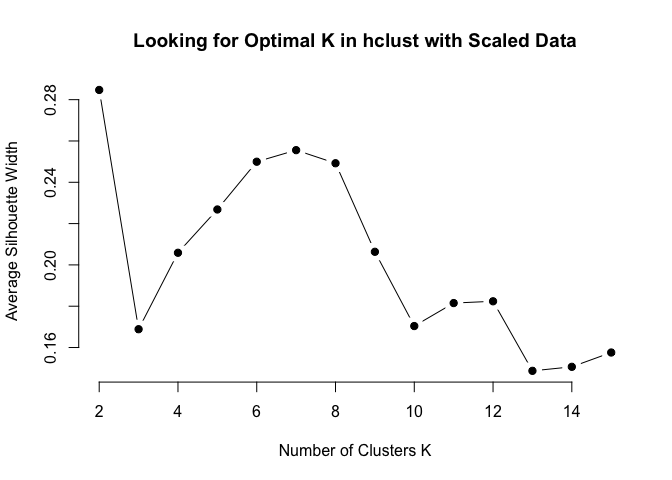

Comparing the Clustering Methods
================================

``` r
y_scale = range(c(avg_sil_values_kmeans_raw, avg_sil_values_hclust_raw, 
                  avg_sil_values_kmeans_scaled, avg_sil_values_hclust_scaled))
plot(k.values, avg_sil_values_kmeans_raw,
      type = "b", pch=19, frame = FALSE, col = 1,
      xlab = "Number of Clusters K",
      ylab = "Average Silhouette Width",
      ylim = y_scale)
par(new = TRUE)
plot(k.values, avg_sil_values_hclust_raw,
      type = "b", pch=19, frame = FALSE, axes = FALSE, col = 2,
      xlab = "",
      ylab = "",
      ylim = y_scale)
par(new = TRUE)
plot(k.values, avg_sil_values_kmeans_scaled,
      type = "b", pch=19, frame = FALSE, axes = FALSE, col = 3,
      xlab = "",
      ylab = "",
      ylim = y_scale)
par(new = TRUE)
plot(k.values, avg_sil_values_hclust_scaled,
      type = "b", pch=19, frame = FALSE, axes = FALSE, col = 4,
      xlab = "",
      ylab = "",
      ylim = y_scale,
      main = "Clustering Methods Comparison")

# add a legend
legend("topright", lty = 1:2, cex = 0.8,
       legend=c("k means with raw data", "hclust with raw data", 
                "k means with scaled data", "hclust with scaled data"),
       col = c(1, 2, 3, 4)
       )
```

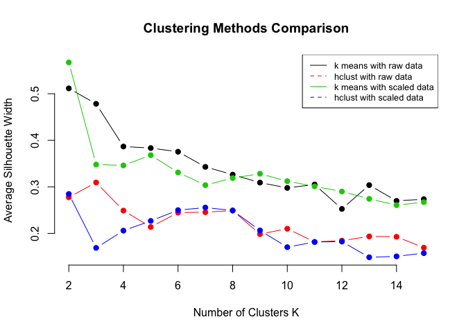

Through the plot it is possible to verify that k means outperforms
hierarchical clustering regardless the chosen value for K (considering
the K chosen is the same to both methods). Regarding the effect of
scaling or not the data on the perfomance, there is no significant
difference between both strategies.

Generally speaking, the best value for K is 2, as the graph shows.
However, for hierarchical clustering with unscaled data, the best result
was obtained for K = 3.

**The best result, according to the average silhouette width, was
obtained using k means with scaled data and 2 clusters.**

Outliers
========

remove\_outliers Function
-------------------------

Let’s define a generic function so it can be applied to different
dataframes. The idea is to remove the outliers that lie outside the
limits 1.5 \* IQR after the 1st quartile (lower bound) and 3rd quartile
(upper bound).

``` r
remove_outliers <- function(df) {
  for (i in names(df)){
    x = df[[i]]
    qnt <- quantile(x, probs=c(.25, .75))
    H <- 1.5 * IQR(x)
    lower_bound = (qnt[1] - H)
    upper_bound = (qnt[2] + H)
    df <- subset(df, x>lower_bound & x<upper_bound)
  }
  return(df)
}
```

Removing Outliers of the Raw Data
---------------------------------

### Boxplot of the Raw Data Before Removing the Outliers

``` r
boxplot(raw_data[, -c(1, 2)], main="Unscaled Data", cex.axis=0.65)
```

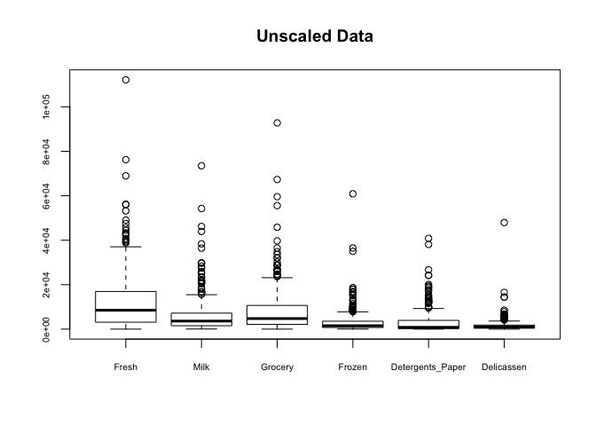

### Boxplot of the Raw Data After Removing the Outliers

``` r
raw_data_no_outliers <- remove_outliers(raw_data[, -c(1, 2)])
```

``` r
dim(raw_data_no_outliers)
```

    ## [1] 318   6

Now, the dataframe contains 318 observations or 72.3% of the
observations on the original data.

``` r
boxplot(raw_data_no_outliers, main="Unscaled Data Without Outliers", cex.axis=0.65)
```

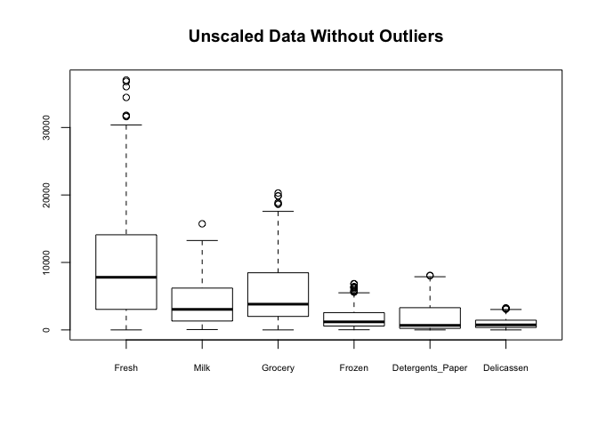

Removing Outliers of the Scaled Data
------------------------------------

### Boxplot of the Scaled Data Before Removing the Outliers

``` r
boxplot(scaled_data[, -c(1, 2, 9)], main="Scaled Data", cex.axis=0.65)
```

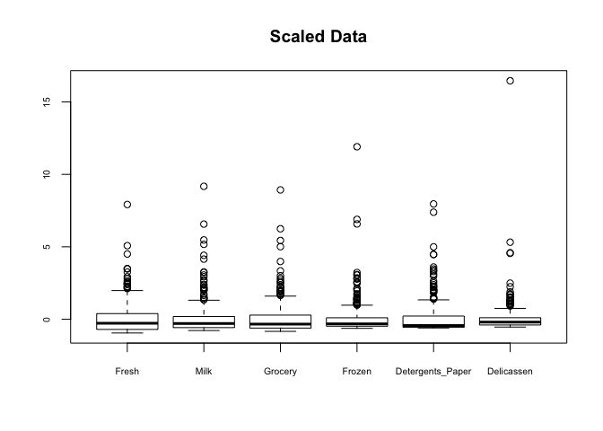

### Boxplot of the Scaled Data After Removing the Outliers

``` r
scaled_data_no_outliers <- remove_outliers(scaled_data[, -c(1, 2, 9)])
```

``` r
boxplot(scaled_data_no_outliers,  main="Scaled Data Without Outliers", cex.axis=0.65)
```

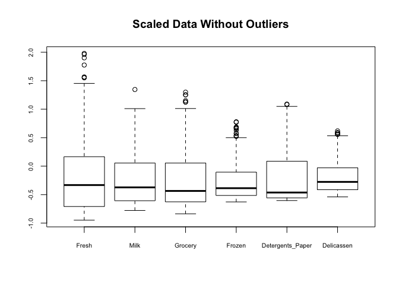

### Comparing the Methods After the Outliers Removal

#### Computing Hierarchical Cluster on Unscaled Data

``` r
hc.complete_no_outliers = hclust(dist(raw_data_no_outliers), method="ward.D")
```

``` r
# extracted from https://uc-r.github.io/kmeans_clustering

# function to compute average silhouette for k clusters
avg_sil <- function(k) {
  ss <- silhouette(cutree(hc.complete_no_outliers, k), dist(raw_data_no_outliers))
  mean(ss[, 3])
}

# compute and plot average silhouette width for k between 2 and 15
k.values <- 2:15

# extract avg silhouette for 2-15 clusters
avg_sil_values_hclust_raw_no <- map_dbl(k.values, avg_sil)

plot(k.values, avg_sil_values_hclust_raw_no,
      type = "b", pch=19, frame = FALSE,
      xlab = "Number of Clusters K",
      ylab = "Average Silhouette Width",
      main = "hclust Performance Without Outliers on Unscaled Data")
```

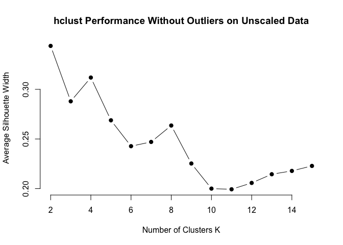

#### Computing Hierarchical Cluster on Scaled Data

``` r
hc.scaled_no_outliers = hclust(dist(scaled_data_no_outliers), method="ward.D")
```

``` r
# extracted from https://uc-r.github.io/kmeans_clustering

# function to compute average silhouette for k clusters
avg_sil <- function(k) {
  ss <- silhouette(cutree(hc.scaled_no_outliers, k), dist(scaled_data_no_outliers))
  mean(ss[, 3])
}

# compute and plot average silhouette width for k between 2 and 15
k.values <- 2:15

# extract avg silhouette for 2-15 clusters
avg_sil_values_hclust_scaled_no <- map_dbl(k.values, avg_sil)

plot(k.values, avg_sil_values_hclust_scaled_no,
      type = "b", pch=19, frame = FALSE,
      xlab = "Number of Clusters K",
      ylab = "Average Silhouette Width",
      main = "hclust Performance Without Outliers on Scaled Data")
```

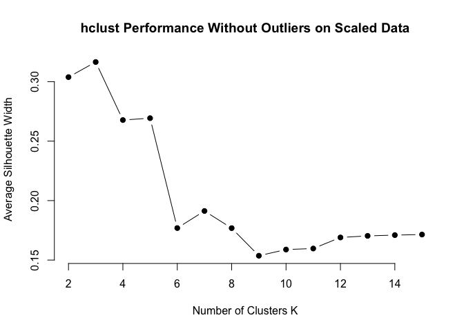

#### Computing k means on Unscaled Data

``` r
# extracted from https://uc-r.github.io/kmeans_clustering

# function to compute average silhouette for k clusters
avg_sil <- function(k) {
  km.out <- kmeans(raw_data_no_outliers, centers=k, nstart=25)
  ss <- silhouette(km.out$cluster, dist(raw_data_no_outliers))
  mean(ss[, 3])
}

# compute and plot average silhouette width for k between 2 and 15
k.values <- 2:15

# extract avg silhouette for 2-15 clusters
avg_sil_values_kmeans_raw_no <- map_dbl(k.values, avg_sil)

plot(k.values, avg_sil_values_kmeans_raw_no,
      type = "b", pch=19, frame = FALSE,
      xlab = "Number of Clusters K",
      ylab = "Average Silhouette Width",
      main = "k-means Performance Without Outliers on Unscaled Data")
```

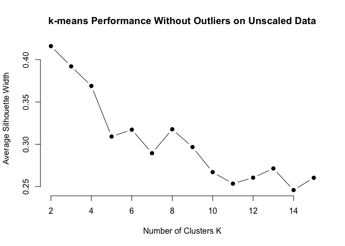

#### Computing k means on Scaled Data

``` r
# extracted from https://uc-r.github.io/kmeans_clustering

# function to compute average silhouette for k clusters
avg_sil <- function(k) {
  km.out <- kmeans(scaled_data_no_outliers, centers=k, nstart=25)
  ss <- silhouette(km.out$cluster, dist(scaled_data_no_outliers))
  mean(ss[, 3])
}

# compute and plot average silhouette width for k between 2 and 15
k.values <- 2:15

# extract avg silhouette for 2-15 clusters
avg_sil_values_kmeans_scaled_no <- map_dbl(k.values, avg_sil)

plot(k.values, avg_sil_values_kmeans_scaled_no,
      type = "b", pch=19, frame = FALSE,
      xlab = "Number of Clusters K",
      ylab = "Average Silhouette Width",
      main = "k-means Performance Without Outliers on Unscaled Data")
```

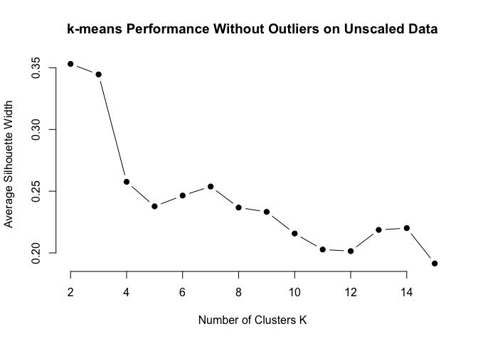

#### Comparing the Results

``` r
y_scale = range(c(avg_sil_values_kmeans_raw_no, avg_sil_values_hclust_raw_no, 
                  avg_sil_values_kmeans_scaled_no, avg_sil_values_hclust_scaled_no))
plot(k.values, avg_sil_values_kmeans_raw_no,
      type = "b", pch=19, frame = FALSE, col = 1,
      xlab = "Number of Clusters K",
      ylab = "Average Silhouette Width",
      ylim = y_scale)
par(new = TRUE)
plot(k.values, avg_sil_values_hclust_raw_no,
      type = "b", pch=19, frame = FALSE, axes = FALSE, col = 2,
      xlab = "",
      ylab = "",
      ylim = y_scale)
par(new = TRUE)
plot(k.values, avg_sil_values_kmeans_scaled_no,
      type = "b", pch=19, frame = FALSE, axes = FALSE, col = 3,
      xlab = "",
      ylab = "",
      ylim = y_scale)
par(new = TRUE)
plot(k.values, avg_sil_values_hclust_scaled_no,
      type = "b", pch=19, frame = FALSE, axes = FALSE, col = 4,
      xlab = "",
      ylab = "",
      ylim = y_scale,
      main = "Clustering Methods Comparison When Outliers are Removed")

# add a legend
legend("topright", lty = 1:2, cex = 0.8,
       legend=c("k means with raw data", "hclust with raw data", 
                "k means with scaled data", "hclust with scaled data"),
       col = c(1, 2, 3, 4)
       )
```

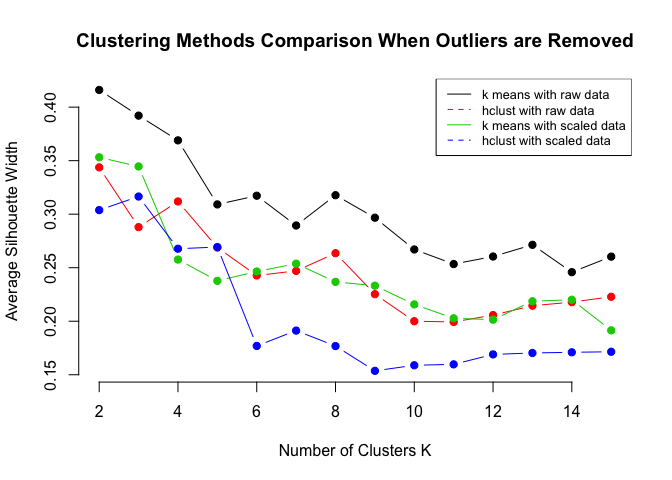

Comparing the previous plot with the similar one obtained with data with
outliers, it is possible to say that the result for the k means got
worse regardless of using scaled data or not. On the other, the
hierarchical cluster performed better (considering the metric chosen),
but not significantly better.

**Now, the best result was obtained using k means with raw data and 2
clusters.**

``` r
y_scale = range(c(avg_sil_values_kmeans_raw, avg_sil_values_kmeans_raw_no, 
                  avg_sil_values_kmeans_scaled, avg_sil_values_kmeans_scaled_no))
plot(k.values, avg_sil_values_kmeans_raw,
      type = "b", pch=19, frame = FALSE, col = 1,
      xlab = "Number of Clusters K",
      ylab = "Average Silhouette Width",
      ylim = y_scale)
par(new = TRUE)
plot(k.values, avg_sil_values_kmeans_raw_no,
      type = "b", pch=19, frame = FALSE, axes = FALSE, col = 2,
      xlab = "",
      ylab = "",
      ylim = y_scale)
par(new = TRUE)
plot(k.values, avg_sil_values_kmeans_scaled,
      type = "b", pch=19, frame = FALSE, axes = FALSE, col = 3,
      xlab = "",
      ylab = "",
      ylim = y_scale)
par(new = TRUE)
plot(k.values, avg_sil_values_kmeans_scaled_no,
      type = "b", pch=19, frame = FALSE, axes = FALSE, col = 4,
      xlab = "",
      ylab = "",
      ylim = y_scale,
      main = "How Removing Outliers Influences k-means Performance")

# add a legend
legend("topright", lty = 1:2, cex = 0.8,
       legend=c("raw data with outliers", "raw data no outliers", 
                "scaled data with outliers", "scaled data no outliers"),
       col = c(1, 2, 3, 4)
       )
```

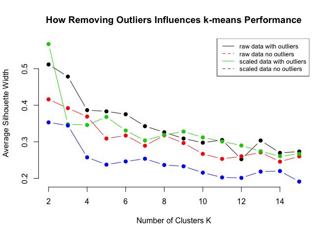

As the previous plot shows, removing outliers caused a negative effect
on k-means performance for scaled and unscaled data.

``` r
y_scale = range(c(avg_sil_values_hclust_raw, avg_sil_values_hclust_raw_no, 
                  avg_sil_values_hclust_scaled, avg_sil_values_hclust_scaled_no))
plot(k.values, avg_sil_values_hclust_raw,
      type = "b", pch=19, frame = FALSE, col = 1,
      xlab = "Number of Clusters K",
      ylab = "Average Silhouette Width",
      ylim = y_scale)
par(new = TRUE)
plot(k.values, avg_sil_values_hclust_raw_no,
      type = "b", pch=19, frame = FALSE, axes = FALSE, col = 2,
      xlab = "",
      ylab = "",
      ylim = y_scale)
par(new = TRUE)
plot(k.values, avg_sil_values_hclust_scaled,
      type = "b", pch=19, frame = FALSE, axes = FALSE, col = 3,
      xlab = "",
      ylab = "",
      ylim = y_scale)
par(new = TRUE)
plot(k.values, avg_sil_values_hclust_scaled_no,
      type = "b", pch=19, frame = FALSE, axes = FALSE, col = 4,
      xlab = "",
      ylab = "",
      ylim = y_scale,
      main = "How Removing Outliers Influences hclust Performance")

# add a legend
legend("topright", lty = 1:2, cex = 0.8,
       legend=c("raw data with outliers", "raw data no outliers", 
                "scaled data with outliers", "scaled data no outliers"),
       col = c(1, 2, 3, 4)
       )
```

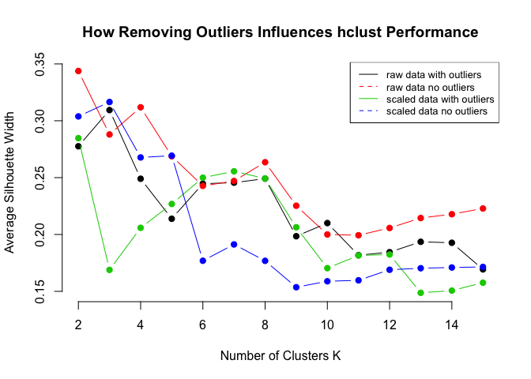

Removing outliers has not caused any significant difference on the
hierarchical clustering performance.
